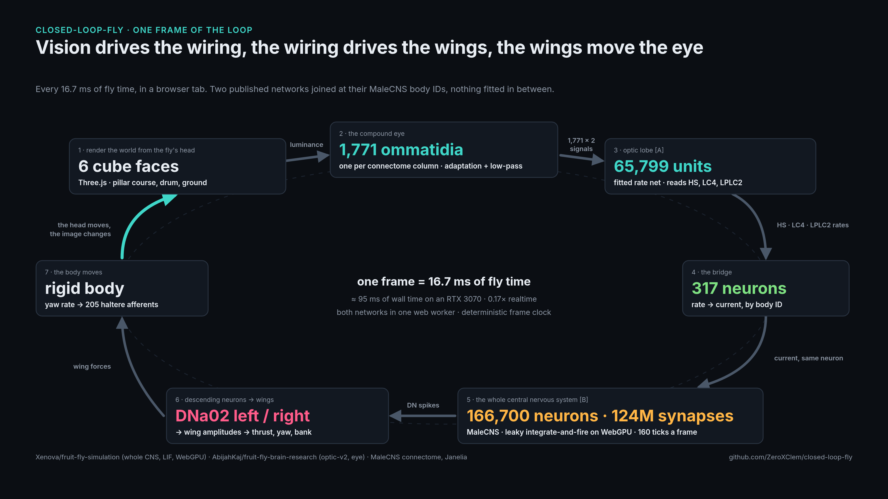
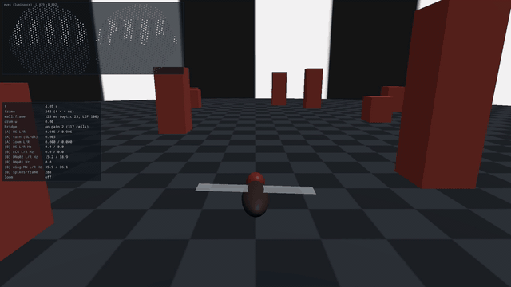

# Closed-Loop Fly

A sensorimotor loop through the male *Drosophila* connectome, in the browser: rendered
images drive the optic lobe, the wiring drives the descending neurons, their rates drive
the wings, and the body's new pose drives the next frame's image.





*Above: the intact cruise, one frame per simulated frame, exactly as `bench/ablate.mjs` runs it.
Full 1080p60 video: `docs/cruise-intact-1080p.mp4`. Eighteen figures with their sources:
[`docs/figures/`](docs/figures/README.md).*

Two upstream projects, combined at MaleCNS body IDs:

- **Front end:** [AbijahKaj/fruit-fly-brain-research](https://github.com/AbijahKaj/fruit-fly-brain-research) —
  the compound eye sampled at the connectome's 1,771 column directions and a rate model of
  the 65.8k-unit optic lobe with parameters fitted on an RTX 5090.
- **Back end:** [Xenova/fruit-fly-simulation](https://huggingface.co/spaces/Xenova/fruit-fly-simulation) —
  the full MaleCNS graph as a leaky integrate-and-fire network on WebGPU, plus the
  NeuroMechFly body.

Credit for everything that works belongs to those two authors and to the FlyEM MaleCNS
team. See `DATA-LICENSE.md`.

## The numbers, once

One vocabulary for the whole repo, the docs and the figures. A **connection** (an edge) is one
directed pre → post pair; its **synapse count** is the number of synapses in that pair.

| | whole CNS [B], Xenova | optic lobe [A], AbijahKaj | [A] found in [B] |
| --- | --- | --- | --- |
| neurons | 166,700 | 65,799 | 65,799 (100%) |
| connections | 25,582,938 | 1,967,771 | 1,967,771 (100%) |
| synapses | 124,177,617 | 13,444,332 | identical counts on every connection |

From `bench/overlap.mjs`, `bench/edges.mjs` and Xenova's `manifest.json`. Two caveats that
travel with the results: the closed loop steers on **DNa02**, a walking-turn descending neuron,
because the published DNg02 code does not lateralise in this un-refit LIF (a labelled
deviation, `DECISIONS.md`); and "zero collisions" holds for every **intact** run, while one fresh
bridge-off capture clipped a pillar (`docs/figures/09-trajectories.png`).

## Status

All six phases have been run once (2026-09-07). Read them in order: `docs/recon.md`
(Phase 0), `docs/phase1.md` (inject/rates on Xenova's LIF), `docs/phase2.md` (the eye),
`docs/phase3.md` (the two-network bridge: looming works end to end, DNg02 does not
lateralise in the un-refit LIF), `docs/phase4.md` (motor readout: the published DNg02 code
cannot steer here; a labelled DNa02 deviation can), `docs/phase5.md` (closed-loop cruise),
`docs/ablations.md` (Phase 6), then `docs/followups.md` (the octopamine hypothesis killed, the
haltere sign explained). Reasons in `DECISIONS.md`, the plan in `GOAL.md`, every number in
`bench/out/`.

The main page (`loop.html`) runs the loop; `index.html` is Xenova's paint demo on the new
worker; `eye.html` is the eye alone.

## Layout

```
GOAL.md            the build plan
docs/recon.md      Phase 0 findings, with file:line references into vendor/
DECISIONS.md       design log
DATA-LICENSE.md    what data is used and under which license
bench/             scripts that print numbers; every claim in this README gets one
bench/out/         their outputs, committed
docs/figures/      the figure set, rendered from bench/out by make.py
vendor/            upstream repos as git submodules, never edited in place
src/               new code (from Phase 1)
```

## Setup

Everything runs through the Nix flake (`flake.nix`); the only host requirements are Nix with
flakes and, for GPU work, Brave plus the NVIDIA Vulkan driver (see `DECISIONS.md`).

```sh
git clone --recurse-submodules <this repo>     # git-lfs pulls the data; or see below
nix develop                                    # node >= 22.12, git-lfs, python + pyarrow/pandas
npm install
npm run bench                                  # overlap, edge and annotation-table checks (CPU)
npm run bench:inject                           # Phase 1 acceptance on the JavaScript LIF (CPU)
npm run dev                                    # Xenova's demo booted from src/ (WebGPU in the browser); /eye.html is the eye demo
npm run bench:eye                              # eye: drum-direction bench (software GL is enough)
npm run bench:gpu                              # headless Brave + WebGPU on the GPU box
nix develop -c node bench/parity.mjs           # full-graph CPU-vs-GPU parity (GPU box)
scripts/gpu-box.sh runx "node bench/bridge.mjs" # Phase 3 bridge (GPU box, headed under Xvfb)
scripts/gpu-box.sh runx "node bench/motor.mjs"  # Phase 4 optomotor / loom
scripts/gpu-box.sh runx "node bench/cruise.mjs --record"   # Phase 5 cruise + video
scripts/gpu-box.sh runx "node bench/ablate.mjs" # Phase 6, then: node bench/ablate-report.mjs
nix build '.?submodules=1'                     # pure dist/ (npm deps and data by hash)
```

Without git-lfs, the same data assets come from the flake as fixed-output fetches:
`cp -r $(nix build '.?submodules=1#assets' --print-out-paths)/vendor/. vendor/`.

The GPU box is driven from a checkout via `scripts/gpu-box.sh sync|run` (rsync mirror; `run`
executes inside `nix develop` there).
