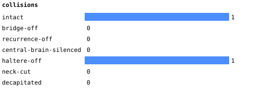
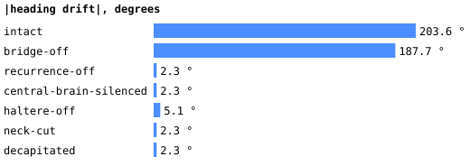
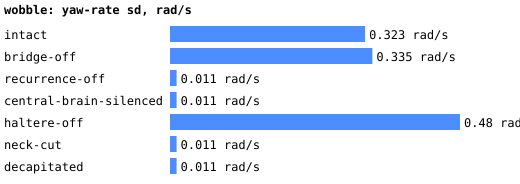
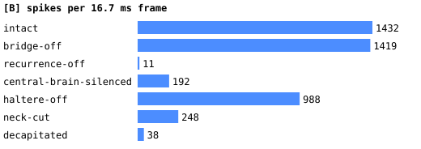

# Ablations

Pillar-course cruise (20 s, base amplitude 0.7) under each condition. Readout: **dna02** (deviation from the plan, see DECISIONS.md: the DNg02 code does not steer in this LIF); bridge gain 2, DNg02 tonic 0.4 mV/ms, turn gain 2, haltere proxy sign -1 (docs/phase5.md; docs/followups.md §2 on what it really does); **readout gate on** (a silent pair commands nothing) and rest re-centring τ 0 s (docs/followups.md §3). Generated by `bench/ablate-report.mjs` from `bench/out/ablate-dna02-gated.json`.

| condition | collisions | heading drift | max excursion | wobble (yaw-rate sd) | distance | DNg02 L/R | DNa02 L/R | wing MN L/R | spikes/frame | muted |
| --- | --- | --- | --- | --- | --- | --- | --- | --- | --- | --- |
| intact | 1 | 203.6° | 203.6° | 0.323 rad/s | 16.6 | 18.1 / 16.4 | 13.3 / 9.4 | 49.5 / 50.6 | 1432 | 0 |
| bridge-off | 0 | 187.7° | 187.7° | 0.335 rad/s | 16.5 | 18.2 / 16.6 | 13.7 / 9.2 | 50.2 / 50.9 | 1419 | 0 |
| recurrence-off | 0 | -2.3° | 2.3° | 0.011 rad/s | 15.5 | 22.6 / 22.6 | 0 / 0 | 0 / 0 | 11 | 0 |
| central-brain-silenced | 0 | -2.3° | 2.3° | 0.011 rad/s | 15.5 | 21.1 / 21.9 | 0 / 0 | 52 / 49.8 | 192 | 37229 |
| haltere-off | 1 | -5.1° | 77° | 0.48 rad/s | 17.2 | 19.7 / 19.7 | 13.9 / 10.4 | 52.1 / 49.8 | 988 | 0 |
| neck-cut | 0 | -2.3° | 2.3° | 0.011 rad/s | 15.5 | 0 / 0 | 0 / 0 | 27.2 / 26.2 | 248 | 1332 |
| decapitated | 0 | -2.3° | 2.3° | 0.011 rad/s | 15.5 | 0 / 0 | 0 / 0 | 27.2 / 26.2 | 38 | 143828 |

## Conditions

- **intact**: bridge on, haltere proxy on.
- **bridge-off**: [B] gets no visual input (its own photoreceptors are dead; the null).
- **recurrence-off**: Xenova's `silenced` flag: spikes are recorded but never delivered.
- **central-brain-silenced**: every `cb_*` superclass neuron held below threshold (only optic lobe, descending neurons and VNC live).
- **haltere-off**: no yaw-rate current on the 205 haltere afferents.
- **neck-cut**: all descending neurons held below threshold (brain → VNC edges carry nothing).
- **decapitated**: the whole brain (central, optic, visual projection, descending) held below threshold; the VNC alone.

Muting is a −50 mV/ms current through the inject path, not an edge deletion: the cells exist, cannot fire, and their incoming synapses still count toward nothing.

## Reading the table

- **Vision matters.** Bridge off is the null: the same fly with no visual input drifts 187.7° against 203.6° intact, with the same collisions (0 vs 1) over 20 s.
- **The haltere proxy is the stabiliser.** Without it the drift is -5.1° and the wobble 0.48 rad/s, against 203.6° and 0.323 rad/s.
- **Silent readout populations spin the fly, and that is the readout, not the biology.** In recurrence-off, central-brain-silenced, neck-cut, decapitated the readout populations are (near) silent, so the rest-subtracted command saturates at the maximum turn and the trajectory is the same in each (-2.3°). For those conditions the substantive result is the rates: recurrence-off: DNg02 22.6/22.6, DNa02 0/0, wing MN 0/0 Hz; central-brain-silenced: DNg02 21.1/21.9, DNa02 0/0, wing MN 52/49.8 Hz; neck-cut: DNg02 0/0, DNa02 0/0, wing MN 27.2/26.2 Hz; decapitated: DNg02 0/0, DNa02 0/0, wing MN 27.2/26.2 Hz.
- **Recurrence off** leaves only what is injected: DNg02 at its tonic rate (22.6/22.6 Hz), everything downstream silent (wing MN 0/0 Hz). The VNC produces nothing from descending drive alone without transmission.
- **Neck cut and decapitated look alike:** the wing motor neurons keep firing at 27.2/26.2 and 27.2/26.2 Hz from the VNC's own input (the haltere afferents enter the VNC directly), so the VNC does hold activity without the brain, but it is a driven response, not a demonstrated central pattern generator.
- **Central brain silenced** (37229 cells) still leaves the optic lobe → descending → VNC path: wing MN 52/49.8 Hz, DNa02 0/0 Hz; the reflex-only fly has a weaker, still lateralised drive.
- Collisions over 20 s: intact 1, bridge-off 0, recurrence-off 0, central-brain-silenced 0, haltere-off 1, neck-cut 0, decapitated 0.
