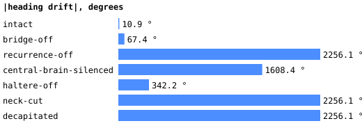
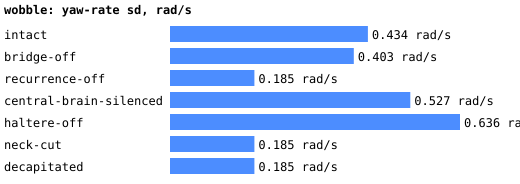
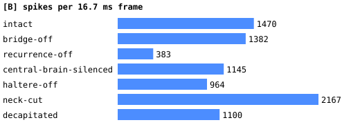

# Ablations

Pillar-course cruise (20 s, base amplitude 0.7) under each condition. Readout: **dna02** (deviation from the plan, see DECISIONS.md: the DNg02 code does not steer in this LIF); bridge gain 2, DNg02 tonic 0.4 mV/ms, turn gain 2, haltere proxy sign -1 (the corrective one, docs/phase5.md). Generated by `bench/ablate-report.mjs` from `bench/out/ablate-dna02.json`.

| condition | collisions | heading drift | max excursion | wobble (yaw-rate sd) | distance | DNg02 L/R | DNa02 L/R | wing MN L/R | spikes/frame | muted |
| --- | --- | --- | --- | --- | --- | --- | --- | --- | --- | --- |
| intact | 0 | -10.9° | 22.6° | 0.434 rad/s | 16.3 | 17.5 / 16.1 | 15 / 8.4 | 49.7 / 48.6 | 1470 | 0 |
| bridge-off | 0 | -67.4° | 74.5° | 0.403 rad/s | 16.4 | 16.8 / 16 | 15 / 7 | 49.5 / 47.8 | 1382 | 0 |
| recurrence-off | 0 | -2256.1° | 2256.1° | 0.185 rad/s | 53.7 | 22.6 / 22.6 | 0 / 0 | 0 / 0 | 383 | 0 |
| central-brain-silenced | 0 | -1608.4° | 1608.4° | 0.527 rad/s | 40.1 | 11.3 / 9.3 | 2.6 / 0 | 26.7 / 21.7 | 1145 | 37229 |
| haltere-off | 0 | -342.2° | 342.2° | 0.636 rad/s | 19.6 | 20.1 / 20 | 14.3 / 9.3 | 51.8 / 49.7 | 964 | 0 |
| neck-cut | 0 | -2256.1° | 2256.1° | 0.185 rad/s | 53.7 | 0 / 0 | 0 / 0 | 22.6 / 18 | 2167 | 1332 |
| decapitated | 0 | -2256.1° | 2256.1° | 0.185 rad/s | 53.7 | 0 / 0 | 0 / 0 | 22.3 / 17.8 | 1100 | 143828 |

## Conditions

- **intact**: bridge on, haltere proxy on.
- **bridge-off**: [B] gets no visual input (its own photoreceptors are dead; the null).
- **recurrence-off**: Xenova's `silenced` flag: spikes are recorded but never delivered.
- **central-brain-silenced**: every `cb_*` superclass neuron held below threshold (only optic lobe, descending neurons and VNC live).
- **haltere-off**: no yaw-rate current on the 205 haltere afferents.
- **neck-cut**: all descending neurons held below threshold (brain → VNC edges carry nothing).
- **decapitated**: the whole brain (central, optic, visual projection, descending) held below threshold; the VNC alone.

Muting is a −50 mV/ms current through the inject path, not an edge deletion: the cells exist, cannot fire, and their incoming synapses still count toward nothing.

## Reading the table

- **Vision matters.** Bridge off is the null: the same fly with no visual input drifts -67.4° against -10.9° intact, with the same collisions (0 vs 0) over 20 s.
- **The haltere proxy is the stabiliser.** Without it the drift is -342.2° and the wobble 0.636 rad/s, against -10.9° and 0.434 rad/s.
- **Silent readout populations spin the fly, and that is the readout, not the biology.** In recurrence-off, neck-cut, decapitated the readout populations are (near) silent, so the rest-subtracted command saturates at the maximum turn and the trajectory is the same in each (-2256.1°). For those conditions the substantive result is the rates: recurrence-off: DNg02 22.6/22.6, DNa02 0/0, wing MN 0/0 Hz; neck-cut: DNg02 0/0, DNa02 0/0, wing MN 22.6/18 Hz; decapitated: DNg02 0/0, DNa02 0/0, wing MN 22.3/17.8 Hz.
- **Recurrence off** leaves only what is injected: DNg02 at its tonic rate (22.6/22.6 Hz), everything downstream silent (wing MN 0/0 Hz). The VNC produces nothing from descending drive alone without transmission.
- **Neck cut and decapitated look alike:** the wing motor neurons keep firing at 22.6/18 and 22.3/17.8 Hz from the VNC's own input (the haltere afferents enter the VNC directly), so the VNC does hold activity without the brain, but it is a driven response, not a demonstrated central pattern generator.
- **Central brain silenced** (37229 cells) still leaves the optic lobe → descending → VNC path: wing MN 26.7/21.7 Hz, DNa02 2.6/0 Hz; the reflex-only fly has a weaker, still lateralised drive.
- All runs: zero collisions over 20 s on this course at 0.77 units/s; collisions never discriminated between conditions at this length.
